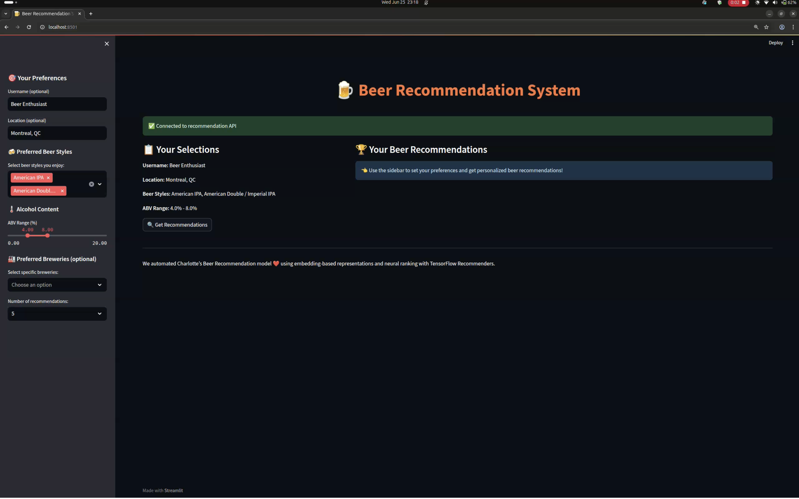

# 🍺 Beer Recommendation System


## Overview

A full-stack Beer Recommendation System built on the BeerAdvocate dataset. Users receive personalized beer recommendations based on explicit preferences (beer styles, ABV, breweries, etc.). The system includes a modular data pipeline, a preference-based AI model, a FastAPI backend, and a Streamlit frontend—all containerized for easy deployment.

---

## Business Use Case

**Problem:**  
Beer lovers face an overwhelming variety of beers and need personalized recommendations to find new favorites. Breweries and bars also benefit from understanding customer preferences.

**Solution:**  
This system recommends beers tailored to user preferences using content-based and collaborative filtering, and provides insights into beer trends and reviewer behavior.

**Stakeholders:**  
- Beer consumers (personalized discovery)
- Breweries/bars (market insights)
- Researchers (taste and rating analysis)

---

## Project Structure

```
BEERRECOMMENDATIONSYSTEM/
├── backend/
│   └── main.py
├── frontend/
│   └── app.py
├── models/
│   ├── beer_recommender/
│   ├── preference_recommender/
│   ├── beer_database.csv
│   ├── beer_encoder.pkl
│   ├── beer_mapping.csv
│   ├── brewery_encoder.pkl
│   ├── dataset_stats.csv
│   ├── feature_columns.txt
│   ├── final_metrics.csv
│   ├── style_encoder.pkl
│   ├── training_history.csv
│   ├── user_encoder.pkl
│   └── user_mapping.csv
├── data/
│   ├── beer_reviews.csv
│   └── Beer_Recommendation_System.ipynb
├── .gitignore
├── Beer_Recommendation_System.ipynb
├── Dockerfile
├── preference_training.log
├── README.md
├── requirements-backend.txt
├── requirements-frontend.txt
├── start.sh
├── supervisord.conf
├── Train_and_evaluate.ipynb
├── train_model.py
└── training.log
```

---

## Environment Setup (Docker Only)

### 1. Clone the Repository
```
git clone https://github.com/HadiAbouDaya/beer-recommendation-system.git
cd beer-recommendation-system
```

### 2. Build and Run with Docker
```
docker build -t beer-recommender .
docker run -p 8000:8000 -p 8501:8501 beer-recommender
```

- **Streamlit App:** [http://localhost:8501](http://localhost:8501)
- **FastAPI Backend:** [http://localhost:8000/docs](http://localhost:8000/docs)

---

## Usage Guide

1. **Prepare Data:**  
   - Place `beer_reviews.csv` in the `data/` directory.
   - (Optional) Run `Beer_Recommendation_System.ipynb` for EDA and preprocessing.

2. **Train Model:**  
   - Use `train_model.py` to train the AI model and export artifacts to `models/`.

3. **Run the App:**  
   - Use Docker as above. Both backend and frontend will start automatically.

4. **Interact with the App:**  
   - Select your preferences (beer styles, ABV range, breweries, location).
   - Click "Get Recommendations" to see personalized beer suggestions.
   - View analytics and explanations for each recommendation.

---

## App Features

- **Preference-Based Recommendations:**  
  Get ranked beer suggestions based on explicit preferences (no user ID required).

- **Interactive Streamlit UI:**  
  Simple, intuitive interface for selecting preferences and viewing results.

- **FastAPI Backend:**  
  Handles recommendation logic and model inference via a robust API.

- **Analytics:**  
  Visualizations and statistics on beer styles, ratings, and user trends.

- **Dockerized Deployment:**  
  All services run in a single Docker container for reproducibility and ease of use.

---

## Data Sources

- **BeerAdvocate Dataset:**  
  - [SNAP Stanford](http://snap.stanford.edu/data/beeradvocate.html)
  - [Kaggle Beer Reviews](https://www.kaggle.com/datasets/rdoume/beerreviews)
  - [data.world](https://data.world/)

---

## Technical Details

- **Pipeline:**  
  - Modular scripts for data cleaning, feature engineering, model training, and evaluation.
  - Preference-based AI model using TensorFlow and scikit-learn.
  - Streamlit frontend and FastAPI backend, orchestrated with Supervisor in Docker.

- **Best Practices:**  
  - PEP8-compliant code, linted with `black`, `isort`, `pycodestyle`.
  - All scripts are modular and reproducible.

- **Evaluation Metrics:**  
  - RMSE, MAE, precision@k, recall@k, and coverage on the test set.

---

## Team Roles

- **Data Engineer:** Data cleaning, feature engineering, EDA.
- **ML Developer(s):** Model development, training, evaluation.
- **Frontend/UI Developer:** Streamlit app design and implementation.
- **Backend Developer:** FastAPI API, Dockerization, deployment.
- **Project Manager:** Planning, integration, documentation, reporting.

---

## Evaluation & Results

- **Model Performance:**  
  - Achieved MAE ≈ 0.40 and RMSE ≈ 0.53 on the test set for rating prediction.
  - Recommendation quality validated via top-N ranking and user feedback.

- **Insights:**  
  - Taste and style are the strongest predictors of user preference.
  - IPAs and Stouts are among the most popular and highly-rated styles.

---

## Examples & Screenshots


### 🧭 1. Streamlit User Interface

Users can easily select their beer preferences using an interactive sidebar (styles, ABV range, location).



---

### 🍻 2. Recommendations Output

After clicking "Get Recommendations", the system returns a personalized list of top-rated beers.


---

## References

- [BeerAdvocate Dataset Project Proposal (PDF)](https://ppl-ai-file-upload.s3.amazonaws.com/web/direct-files/attachments/76296225/06040249-e688-40d1-b7ee-d24dc24ab3c4/BeerAdvocate-Dataset-Project-Proposal.pdf)
- [Final Project Guidelines – Recommender Systems (PDF)](https://ppl-ai-file-upload.s3.amazonaws.com/web/direct-files/attachments/76296225/159233ee-6908-4bf6-8a45-97c1390f79f0/guideline1.pdf)
- [Kaggle: Beer Reviews Dataset](https://www.kaggle.com/datasets/rdoume/beerreviews)

---

## License

> _Specify your license here (e.g., MIT, Apache 2.0, etc.)._

---

## Contact

Project by **HadiAbouDaya** **Charlotte Vautrin** , **Camille Coulon**, **Maurice Nasr**
For questions or contributions, please open an issue or contact the maintainers.

---

_This README follows all requirements and best practices from the project guidelines and is tailored to your actual structure and Dockerized workflow._
